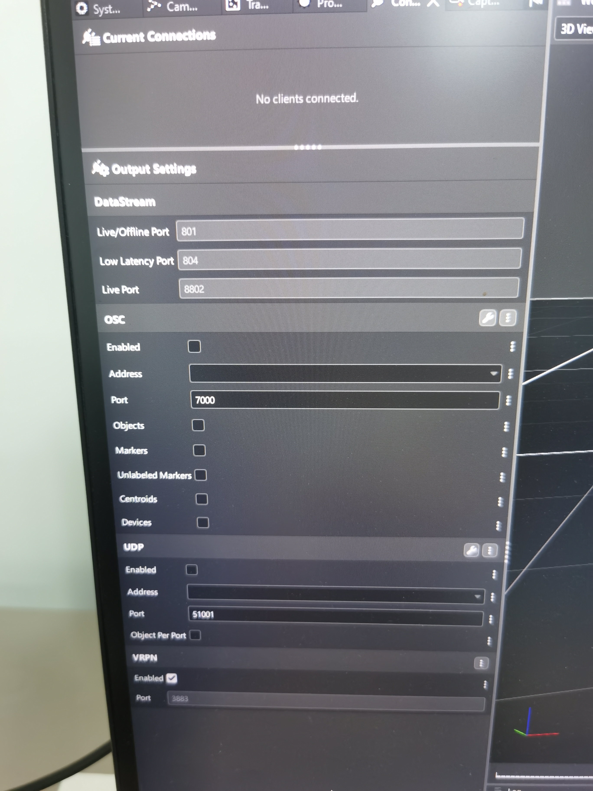

# Vicon DataStream MCP Server

[](https://modelcontextprotocol.io/)
[](https://www.python.org/)
[](https://www.vicon.com/)
[](./docs/Vicon%20DataStream%20SDK%20Manual.pdf)

Based on [MCP (Model Context Protocol)](https://modelcontextprotocol.io/) **full-featured** Vicon motion capture data streaming server.

**📚 SDK Reference**: [Vicon DataStream SDK Manual.pdf](./docs/Vicon%20DataStream%20SDK%20Manual.pdf)  
**📦 Based on SDK**: Vicon DataStream SDK v1.12.145507h (Win64 Python)

**✨ 100% Feature Complete**: Implements all 47+ core functions of Vicon DataStream SDK.

---

## 📋 功能特性

### 🔌 连接管理
- ✅ TCP 直连（端口 801）
- ✅ Multicast 组播连接（224.0.0.0/4）
- ✅ Multicast 转发控制
- ✅ 可配置缓冲区大小

### 🏃 运动学数据（完整）
- ✅ **全局姿态**：位置 + 4 种旋转格式（欧拉角/四元数/矩阵/**螺旋角**）
- ✅ **本地姿态**：相对父段变换，4 种旋转格式
- ✅ **静态偏移**：PRE-POSITION/PRE-ORIENTATION
- ✅ **段层次结构**：父段、子段、根段
- ✅ **遮挡状态**：实时标记

### 📍 标记点追踪
- ✅ Labeled Markers（主体+父段+位置+遮挡）
- ✅ Unlabeled Markers（原始反射点）
- ✅ **Marker Ray 追踪**（光线追踪相机分配）

### 📊 生物力学设备
- ✅ **力板数据**：
  - 全局坐标：力向量(N)、力矩向量(Nm)、压力中心(mm)
  - **本地坐标**：相对力板自身坐标系
  - 模拟通道电压
- ✅ **眼动仪**：眼睛位置 + 注视向量（含遮挡检测）
- ✅ **通用设备**：EMG 等，自动识别单位

### 📷 相机与质心
- ✅ 相机列表（ID、类型、分辨率、显示名称）
- ✅ 动态相机（可移动相机）
- ✅ **相机标定参数**：
  - 全局位姿（平移+4种旋转）
  - 镜头参数（焦距、主点、畸变系数 k1,k2,k3）
- ✅ 质心数据（每相机反射点位置+权重）

### ⚙️ 高级配置
- ✅ 3 种流模式（ClientPull/ClientPullPreFetch/ServerPush）
- ✅ **主体过滤**（只接收指定主体）
- ✅ 坐标系映射（6方向自定义，自动识别 Unity/Unreal/ROS）
- ✅ 延迟分析（总延迟+各阶段分解）
- ✅ 时间码（时:分:秒:帧）
- ✅ 无线网络优化（Windows）

---

## 📚 文档导航

| 文档 | 说明 |
|------|------|
| [📖 Windows 完整安装指南](docs/WINDOWS_SETUP.md) | **Windows 系统详细安装、配置、故障排除** |
| [⚙️ 配置参考](docs/CONFIG.md) | OpenClaw/Claude Desktop 配置详情 |
| [🏗️ 架构说明](docs/ARCHITECTURE.md) | 系统架构与技术细节 |
| [✅ 功能清单](CHECKLIST.md) | 完整功能核对表 |
| [📄 SDK 开发手册](docs/Vicon%20DataStream%20SDK%20Manual.pdf) | **Vicon DataStream SDK v1.12.145507h 官方 PDF 文档** |

### Windows 用户快速入口

如果你使用 **Windows** 系统，请查看 **[Windows 完整安装指南](docs/WINDOWS_SETUP.md)**，包含：
- Vicon SDK 下载与安装步骤
- SDK 目录结构详细说明
- OpenClaw 连接配置（含多服务器配置）
- 端口说明（801/804/8802/7000/51001）
- 实时数据获取完整教程
- 故障排除与性能优化



---

## 🚀 快速开始

### 1. 安装 Vicon SDK

```powershell
cd "D:\Program Files\Vicon\DataStream SDK\Win64\Python"
pip install -e vicon_dssdk
```

### 2. 安装 MCP 依赖

```bash
cd vicon-datastream-mcp
pip install -r requirements.txt
```

### 3. 配置 OpenClaw/Claude Desktop

编辑配置文件（Windows 路径：`C:\Users\<用户名>\.openclaw\openclaw.json`）：

```json
{
  "mcpServers": {
    "vicon": {
      "command": "python",
      "args": ["D:/workspace/rosclaw/mcp/vicon-datastream-mcp/vicon_datastream_mcp.py"],
      "env": {
        "VICON_HOST": "192.168.20.24:801"
      }
    }
  }
}
```

**端口选择参考**：
| 端口 | 适用场景 | 延迟 |
|------|----------|------|
| **801** | DataStream Live/Offline（推荐） | 标准 |
| **804** | DataStream Low Latency | 更低 |
| **8802** | DataStream Live（旧版兼容） | 标准 |

> 💡 **提示**: 如果使用端口 801 连接失败，尝试 804 或 8802

详细配置说明见 [Windows 安装指南](docs/WINDOWS_SETUP.md)

### 4. 运行

```bash
# stdio 模式（默认）
python vicon_datastream_mcp.py

# SSE 模式
python vicon_datastream_mcp.py --transport sse --port 8000
```

---

## 💬 自然语言示例

### 连接和配置
```
"连接到 Vicon 系统" 
→ vicon_connect(host="localhost:801")

"通过组播连接，使用本地 IP 192.168.1.100"
→ vicon_connect_multicast(local_ip="192.168.1.100")

"开启低延迟推送模式"
→ vicon_set_stream_mode("ServerPush")

"设置 Unity 坐标系（Y-up）"
→ vicon_set_axis_mapping("Forward", "Up", "Right")

"只接收 Colin 的数据"
→ vicon_clear_subject_filter() + vicon_add_subject_filter("Colin")
```

### 获取运动学数据
```
"获取 Colin 的骨盆完整姿态"
→ vicon_get_segment(subject_name="Colin", segment_name="Pelvis")
返回: 全局/本地/静态变换，每种包含 Euler/Quaternion/Matrix/Helical

"获取所有段的层次结构"
→ vicon_get_all_segments("Colin")

"获取标记点 LPSI 的光线追踪信息"
→ vicon_get_markers(subject_name="Colin")
```

### 生物力学数据
```
"获取力板的受力和力矩（全局坐标）"
→ vicon_get_force_plates()

"获取力板本地坐标数据"
→ vicon_get_force_plates(include_local=true)

"获取眼动仪 1 的注视方向"
→ vicon_get_eye_tracker(eye_tracker_id=1)
```

### 相机和标定
```
"列出所有相机"
→ vicon_get_cameras()

"获取相机 Vantage001 的标定参数"
→ vicon_get_camera_calibration(camera_name="Vantage001")
返回: 全局位姿 + 焦距 + 畸变系数

"获取相机 1 的质心数据"
→ vicon_get_centroids(camera_name="Vantage 16 (2105980)")
```

### 分析和调试
```
"分析系统延迟瓶颈"
→ vicon_get_latency_samples()
返回: {采集: 0.001s, 处理: 0.005s, 网络: 0.002s}

"获取当前帧的时间码"
→ vicon_get_timecode()
返回: 01:12:24:02

"启用时序日志调试"
→ vicon_set_timing_log(client_log="timing.log")
```

---

## 🛠️ MCP Tools 完整列表 (36个)

### 连接 (5)
| 工具 | 说明 |
|------|------|
| `vicon_connect` | TCP 连接 |
| `vicon_connect_multicast` | 组播连接 |
| `vicon_start_multicast_transmit` | 开始组播转发 |
| `vicon_stop_multicast_transmit` | 停止组播转发 |
| `vicon_set_buffer_size` | 设置缓冲区 |

### 数据配置 (5)
| 工具 | 说明 |
|------|------|
| `vicon_enable_data` | 启用数据类型 |
| `vicon_disable_data` | 禁用数据类型 |
| `vicon_check_data_enabled` | 检查启用状态 |
| `vicon_set_stream_mode` | 设置流模式 |
| `vicon_get_frame` | 获取帧 |

### 时间和延迟 (4)
| 工具 | 说明 |
|------|------|
| `vicon_get_timecode` | 时间码 |
| `vicon_get_frame_rates` | 所有帧率 |
| `vicon_get_latency_total` | 总延迟 |
| `vicon_get_latency_samples` | 延迟样本 |

### 主体和段 (5)
| 工具 | 说明 |
|------|------|
| `vicon_get_subjects` | 主体列表 |
| `vicon_clear_subject_filter` | 清除过滤 |
| `vicon_add_subject_filter` | 添加过滤 |
| `vicon_get_segment` | 单段数据（全格式） |
| `vicon_get_all_segments` | 所有段 |

### 标记点 (2)
| 工具 | 说明 |
|------|------|
| `vicon_get_markers` | 标记点（含光线） |
| `vicon_get_unlabeled_markers` | 未标记点 |

### 设备和力板 (4)
| 工具 | 说明 |
|------|------|
| `vicon_get_devices` | 设备列表 |
| `vicon_set_apex_feedback` | Apex 触觉反馈 |
| `vicon_get_force_plates` | 力板（全局+本地） |
| `vicon_get_analog_voltage` | 模拟电压 |

### 眼动仪 (2)
| 工具 | 说明 |
|------|------|
| `vicon_get_eye_trackers` | 眼动仪列表 |
| `vicon_get_eye_tracker` | 位置+注视向量 |

### 相机 (3)
| 工具 | 说明 |
|------|------|
| `vicon_get_cameras` | 相机列表 |
| `vicon_get_centroids` | 质心数据 |
| `vicon_get_camera_calibration` | 标定参数 |

### 坐标系 (3)
| 工具 | 说明 |
|------|------|
| `vicon_set_axis_mapping` | 设置坐标系 |
| `vicon_get_axis_mapping` | 获取坐标系 |
| `vicon_get_server_orientation` | 服务器方向 |

### 调试 (2)
| 工具 | 说明 |
|------|------|
| `vicon_set_timing_log` | 时序日志 |
| `vicon_configure_wireless` | 无线优化 |

---

## 📡 数据格式示例

### 段姿态（完整）
```json
{
  "subject": "Colin",
  "segment": "Pelvis",
  "global": {
    "translation": {"x": -522.3, "y": -1.6, "z": 1119.1},
    "rotation_euler_xyz": {"x": 0.1, "y": -0.2, "z": 0.05},
    "rotation_quaternion": {"x": 0.0, "y": 0.1, "z": 0.0, "w": 0.99},
    "rotation_matrix": [[1,0,0], [0,1,0], [0,0,1]],
    "rotation_helical": {"x": 0.0, "y": 0.1, "z": 0.0, "magnitude": 0.1},
    "occluded": false
  },
  "local": { /* 相对于父段 */ },
  "static": { /* PRE-POSITION/PRE-ORIENTATION */ },
  "hierarchy": {
    "parent": "Hips",
    "children": ["Spine", "LeftUpperLeg", "RightUpperLeg"]
  }
}
```

### 力板数据
```json
{
  "plate_id": 1,
  "global": {
    "force_vectors": [{"x": 0.0, "y": 0.0, "z": 823.5, "unit": "N"}],
    "moment_vectors": [{"x": 12.3, "y": -5.2, "z": 0.0, "unit": "Nm"}],
    "center_of_pressure": [{"x": 125.0, "y": -45.0, "z": 0.0, "unit": "mm"}]
  },
  "local": {
    /* 相对于力板自身坐标系 */
  }
}
```

### 相机标定
```json
{
  "camera": "Vantage 16 (2105980)",
  "global_pose": {
    "translation": {"x": 1200.5, "y": -800.2, "z": 2400.0, "unit": "mm"},
    "rotation": {
      "euler_xyz": {"x": 0.0, "y": 0.1, "z": 0.0},
      "quaternion": {"x": 0.0, "y": 0.05, "z": 0.0, "w": 0.998}
    }
  },
  "lens": {
    "focal_length_mm": 24.0,
    "principal_point": {"x": 960.0, "y": 540.0},
    "lens_parameters": {"k1": 0.001, "k2": -0.0001, "k3": 0.0}
  }
}
```

---

## 🌐 坐标系快速参考

| 软件 | X | Y | Z | 调用 |
|-----|---|---|---|------|
| Vicon 默认 | Forward | Left | Up | (默认) |
| Unity | Forward | Up | Right | `vicon_set_axis_mapping("Forward", "Up", "Right")` |
| Unreal | Forward | Right | Up | `vicon_set_axis_mapping("Forward", "Right", "Up")` |
| ROS | Forward | Left | Up | `vicon_set_axis_mapping("Forward", "Left", "Up")` |
| Blender | Left | Forward | Up | `vicon_set_axis_mapping("Left", "Forward", "Up")` |

---

## 📁 项目结构

```
vicon-datastream-mcp/
├── vicon_datastream_mcp.py    # 主 MCP Server (77KB, 完整实现)
├── README.md                   # 本文档
├── requirements.txt            # Python 依赖
├── CHECKLIST.md                # ✅ 功能完整性检查表
├── .gitignore
├── docs/
│   ├── CONFIG.md               # 配置指南
│   └── ARCHITECTURE.md         # 架构详解
└── examples/
    ├── basic_usage.py          # 基本示例
    └── ros2_bridge.py          # ROS2 桥接
```

---

## 🐛 故障排除

### SDK 未找到
```powershell
# 方法1: 标准安装
cd "D:\Program Files\Vicon\DataStream SDK\Win64\Python"
pip install -e vicon_dssdk

# 方法2: 设置环境变量
$env:VICON_SDK_PATH = "D:\Program Files\Vicon\DataStream SDK\Win64\Python"
```

### 连接失败
1. Vicon Tracker/Nexus/Evoke 是否已启动？
2. DataStream 是否已启用？（软件设置中）
3. 防火墙是否阻止端口 801？

### 数据为空
确保调用顺序：
1. `vicon_connect()`
2. `vicon_enable_data("segment")`
3. `vicon_get_frame()`
4. `vicon_get_segment(...)`

---

## 📚 相关资源

- [Vicon 官方文档](https://docs.vicon.com/)
- [MCP 协议规范](https://modelcontextprotocol.io/)
- SDK 路径: `D:\Program Files\Vicon\DataStream SDK\`

---

**Made with precision for motion capture professionals** 🎯
